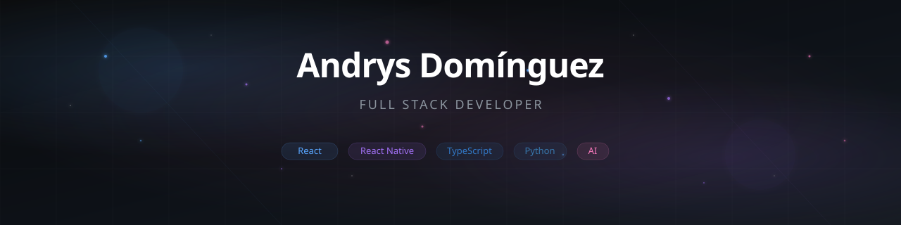
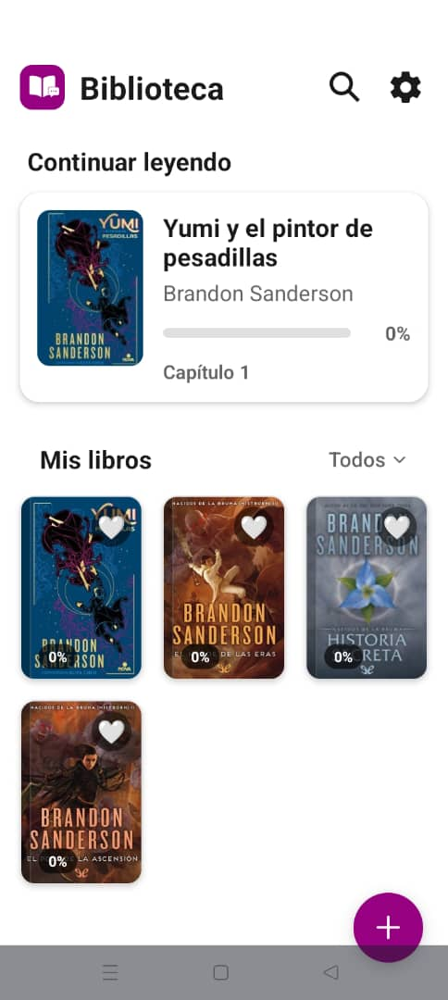
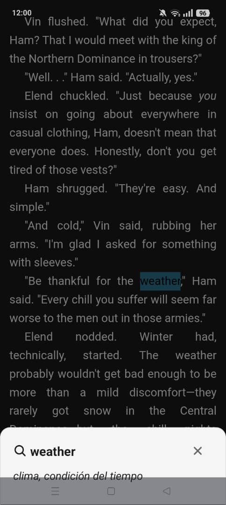
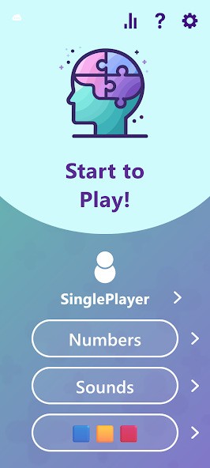
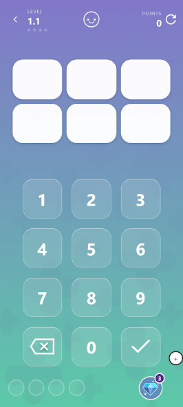
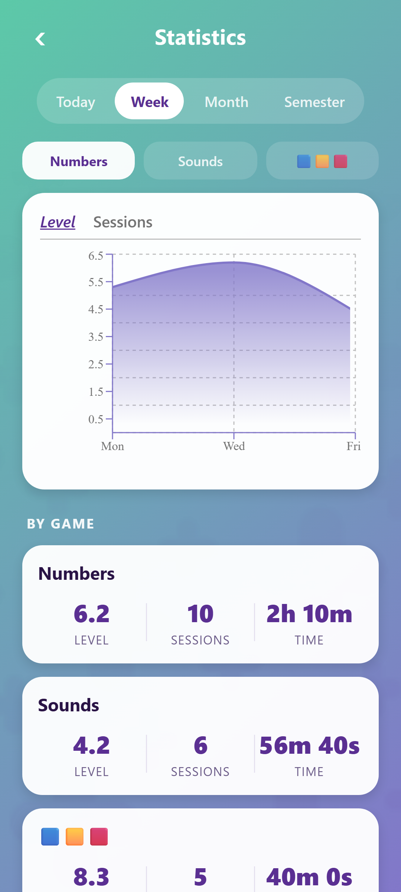

<!-- ============================================================
     ANDRYS DOMÍNGUEZ - PREMIUM GITHUB PROFILE
     A professional, modern, landing-page-style profile.
     ============================================================ -->

<!-- ======================== BANNER ======================== -->
<p align="center">
  <a href="https://github.com/AndrysDM">
    
  </a>
</p>

<!-- ======================== TYPING ANIMATION ======================== -->
<p align="center">
  
</p>

<!-- ======================== BADGES ======================== -->
<p align="center">
  <a href="https://github.com/AndrysDM">
    
  </a>
  <a href="https://github.com/AndrysDM?tab=followers">
    
  </a>
  <a href="https://github.com/AndrysDM?tab=repositories&sort=stargazers">
    
  </a>
  <a href="https://github.com/AndrysDM?tab=repositories">
    
  </a>
</p>

<br/>

<!-- ======================== ABOUT ME ======================== -->
<table align="center">
<tr>
<td>

```javascript
const AndrysDM = {
    name: "Andrys Domínguez",
    role: "Full Stack Developer",
    location: "🌎 Latin America",
    
    languages: ["JavaScript", "TypeScript", "Python"],
    
    frontend: ["React", "React Native", "Next.js", "Vue.js", "TailwindCSS"],
    backend: ["Node.js", "Express", "FastAPI", "Django"],
    databases: ["PostgreSQL", "MongoDB", "Redis", "Firebase"],
    
    tools: ["Git", "Docker", "AWS", "Vercel", "Linux"],
    
    interests: [
        "Artificial Intelligence",
        "Physics",
        "Open Source",
        "Competitive Programming"
    ],
    
    currentFocus: "Building AI-powered applications",
    philosophy: "Code is poetry. Ship with purpose."
};
```

</td>
</tr>
</table>

<br/>

<!-- ======================== DASHBOARD ======================== -->
### Dashboard

<table align="center" width="100%">
<tr>
<td width="50%" valign="top">

#### Current Status


</td>
<td width="50%" valign="top">

#### Activity Overview


</td>
</tr>
</table>

<table align="center" width="100%">
<tr>
<td width="33%" align="center">

**Languages**


</td>
<td width="34%" align="center">

**Frameworks**


</td>
<td width="33%" align="center">

**Tools**


</td>
</tr>
</table>

<br/>

<!-- ======================== TECH STACK ======================== -->
### Tech Stack

<p align="center">
  
</p>

<br/>

<!-- ======================== FEATURED PROJECTS ======================== -->
### Featured Projects

<table align="center" width="100%">
<tr>
<td width="50%" align="center">


<br/>

**[BooksReader](https://github.com/AndrysDM/booksreader)** — E-book reader with offline translation
<br/>


<br/>
<a href="https://github.com/AndrysDM/booksreader"></a>

</td>
<td width="50%" align="center">


<br/>

**[BrainPress](https://github.com/FastLearningSystems-BrainPress/BrainPressMobile)** — Cognitive training app
<br/>


<br/>
<a href="https://github.com/FastLearningSystems-BrainPress/BrainPressMobile"></a>
<a href="https://github.com/FastLearningSystems-BrainPress/BrainPressDesktop"></a>

</td>
</tr>
<tr>
<td width="50%" align="center">


<br/>

**[Business Catalog](https://github.com/AndrysDM/business-catalog)** — Full-stack business directory
<br/>


<br/>
<a href="https://github.com/AndrysDM/business-catalog"></a>

</td>
<td width="50%" align="center">


<br/>

**[Portfolio](https://github.com/AndrysDM/portfolio)** — Personal website with animations
<br/>


<br/>
<a href="https://github.com/AndrysDM/portfolio"></a>

</td>
</tr>
</table>

<br/>

<!-- ======================== PROJECT GALLERY ======================== -->
### 📸 Project Gallery

<details>
<summary><strong>BooksReader</strong> — E-book reader with offline translation</summary>
<br/>

| Library | Reader |
|---------|--------|
|  |  |

</details>

<details>
<summary><strong>BrainPress</strong> — Cognitive training app</summary>
<br/>

| Home | Game | Stats |
|------|------|-------|
|  |  |  |

</details>

<details>
<summary><strong>Business Catalog</strong> — Full-stack business directory</summary>
<br/>

| Map | Listings | Details |
|-----|----------|---------|
| *Screenshots coming soon* | | |

</details>

<details>
<summary><strong>Mando</strong> — Project automation tool</summary>
<br/>

| Controller | Touchpad | Connection |
|------------|----------|------------|
| *Screenshots coming soon* | | |

</details>

<br/>

<!-- ======================== TIMELINE ======================== -->
### Journey

<table align="center" width="100%">
<tr>
<td width="25%" align="center">


</td>
<td width="25%" align="center">


</td>
<td width="25%" align="center">


</td>
<td width="25%" align="center">


</td>
</tr>
</table>

<br/>

<!-- ======================== GITHUB STATS ======================== -->
### GitHub Stats

<table align="center" width="100%">
<tr>
<td width="33%" align="center">


</td>
<td width="34%" align="center">


</td>
<td width="33%" align="center">


</td>
</tr>
</table>

<table align="center" width="100%">
<tr>
<td width="50%" align="center">


</td>
<td width="50%" align="center">


</td>
</tr>
<tr>
<td width="50%" align="center">


</td>
<td width="50%" align="center">


</td>
</tr>
</table>

<br/>

<!-- ======================== GITHUB TROPHIES ======================== -->
### Achievements

<p align="center">
  
</p>

<br/>

<!-- ======================== CONTRIBUTION SNAKE ======================== -->
### Contribution Graph

<p align="center">
  
</p>

<br/>

<!-- ======================== VISITOR COUNTER ======================== -->
<p align="center">
  
</p>

<br/>

<!-- ======================== FOOTER ======================== -->
<p align="center">
  
</p>
